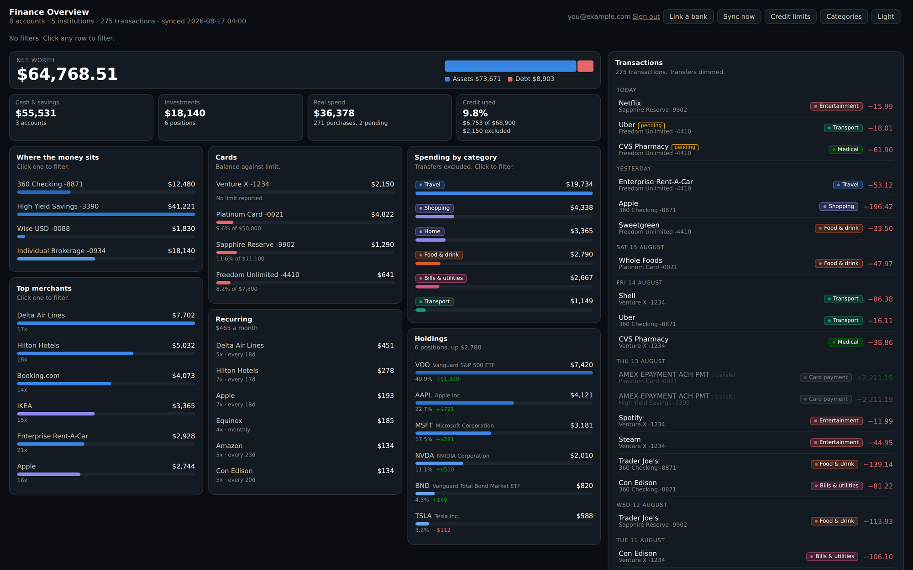
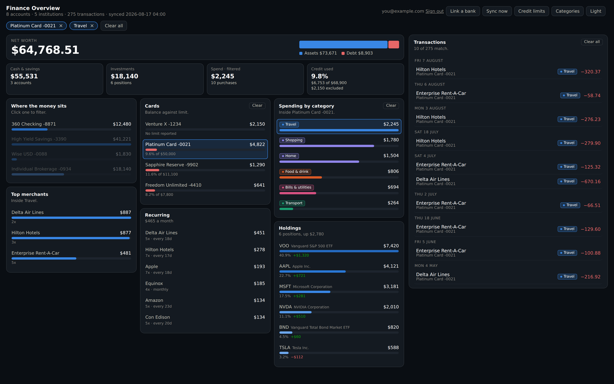
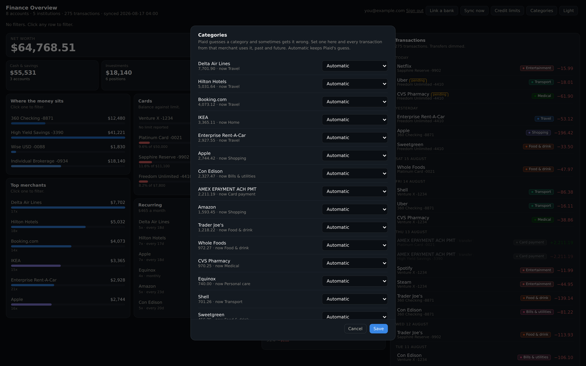
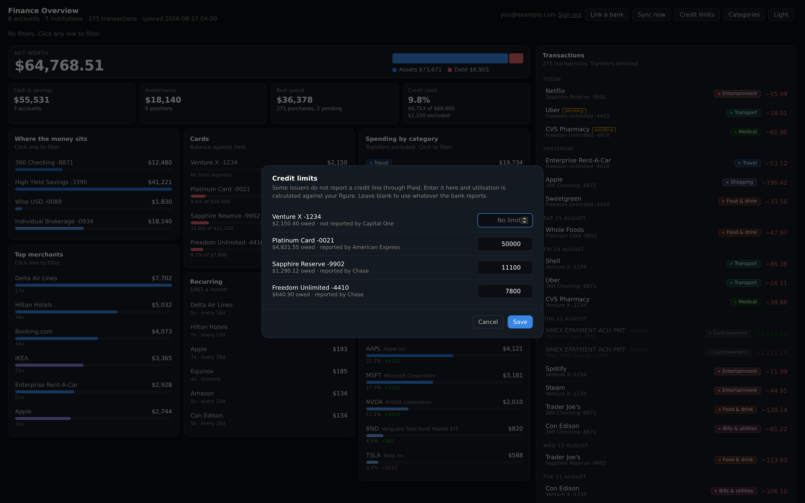
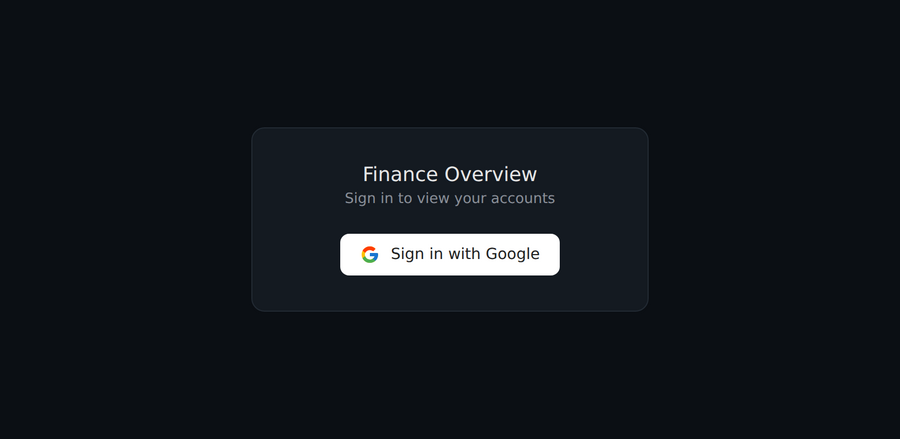
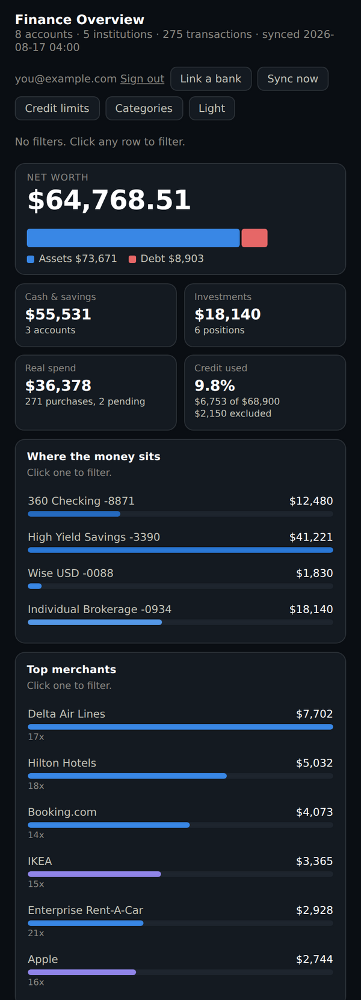

# Finance Overview

A self-hosted dashboard for your own bank accounts. You deploy your own copy. Your financial data stays inside your Cloudflare account and reaches nobody else.

**[See the landing page](https://matanlevanon.github.io/Financials-Overview/)**



## What this is

One page showing every account you own. Balances, credit cards, spending by category, top merchants, recurring charges, investment holdings, and a transaction list you filter by clicking.

The tiles pack into three columns and the transaction list holds the right third of the screen, scrolling on its own so the tiles stay in place. On a phone everything collapses to one column.

Everything runs on Cloudflare's free tier. A daily cron job pulls fresh data from your banks through Plaid, writes to a private D1 database, and the dashboard reads from there. Sign-in uses Google, restricted to an email allowlist you control.

All screenshots on this page use demo data.

## What this is not

- Not a hosted service. There is no account to sign up for. You run your own instance.
- Not a budgeting app. No envelopes, goals, or forecasts.
- Not affiliated with Plaid or any bank.
- Not for non-technical users. Setup needs a Cloudflare account, a Plaid developer account, and a Google OAuth client. Budget an hour.

## Screenshots

Every account, category and merchant row is a filter. Filters combine, so one card plus one category shows only that spending on that card. The chips at the top show what is on, and each block clears on its own.



Plaid guesses a category for each merchant and sometimes gets it wrong. Set the category once and every transaction from that merchant follows, past and future.



Some issuers do not report a credit line through Plaid. Enter yours and utilisation calculates against your figure.



Sign-in is restricted to the email addresses you allowlist.



The three columns collapse to one on a phone. Same data, same filters.



## What you need

| Requirement | Notes |
|---|---|
| Cloudflare account | Free tier covers Workers, D1, and cron triggers |
| Plaid account | Trial plan, free, 10 linked institutions |
| Google Cloud project | For an OAuth 2.0 Web client, free |
| Node and Wrangler | To deploy |

Plaid's Trial plan is open to developers in the US and Canada, with no business registration and no contract. Approval is usually automatic. Moving from Trial to a paid Production plan is a one-way change you do not need for personal use.

## Cost

Zero at this scale. Cloudflare Workers, D1, and cron triggers sit inside the free tier for one user. Plaid's Trial plan is free for 10 institutions.

## Quick start

Full walkthrough in [SETUP.md](SETUP.md). Short version:

```bash
git clone https://github.com/matanlevanon/Financials-Overview.git
cd Financials-Overview

wrangler d1 create finance-overview
# paste the printed database_id into wrangler.toml
wrangler d1 execute finance-overview --remote --file=schema.sql

wrangler secret put PLAID_CLIENT_ID
wrangler secret put PLAID_SECRET
wrangler secret put SESSION_SECRET
wrangler secret put GOOGLE_LOGIN_CLIENT_ID
wrangler secret put GOOGLE_LOGIN_CLIENT_SECRET
wrangler secret put ALLOWED_EMAILS

wrangler deploy
```

Open the deployed URL, sign in, and click Link a bank. Plaid Link runs in the browser and handles two-factor prompts. Your bank credentials go to Plaid and never touch this app.

## Investment holdings

Brokerage accounts break out position by position, with value, share of the portfolio, and gain against cost basis.

Consent is granted per product when you link, so a bank linked before you asked for investments returns a balance and no positions. The Holdings panel says so rather than hiding itself. Open **Link a bank**, press **Add investments** on that connection, walk through the consent, then press **Sync now**. Anything you link from now on asks for it up front.

Not every institution offers the investments product. When one declines, the sync status line names the institution and the reason.

## How the numbers are calculated

Most of the work here went into not showing confident numbers that are wrong. Four decisions worth knowing:

**Net worth subtracts card debt.** A credit card balance is money you owe. Summing every account balance into one figure adds your debt to your assets. The headline nets them.

**Card payments are excluded from spending.** Paying a card off appears twice in Plaid data, once leaving the bank account and once arriving at the card. Counted as spending, one monthly payment cycle dwarfs real purchases. Transfers are tagged and stripped from every spending calculation.

**Utilisation ignores cards with unknown limits.** Some issuers report a credit line, some do not. Substituting the balance, or any other stand-in, invents a denominator. Cards without a known limit are left out of the percentage and reported separately, so you see what the number excludes.

**Pending transactions are replaced, not duplicated.** When a pending charge posts, Plaid issues a new transaction ID and points `pending_transaction_id` at the old one. Ignore that and both copies survive, so every pending purchase counts twice. The sync deletes the superseded row.

## Security

- Your data lives in your own Cloudflare D1 database.
- Bank credentials go directly to Plaid. This app never sees them.
- The dashboard requires Google sign-in, limited to `ALLOWED_EMAILS`.
- Session cookies are HMAC signed, HttpOnly, Secure, SameSite=Lax.
- Plaid access tokens are stored in D1 rather than as Worker secrets, because they are created at runtime when you link a bank and a running Worker cannot write its own secrets. Anyone with access to your Cloudflare account can read them. Treat Cloudflare account access as read access to your linked accounts.
- No analytics, no telemetry, no third-party scripts beyond Plaid Link.

Review the code before you deploy it. This handles your bank data.

## Known limits

- Single user per deployment. No multi-tenant mode.
- Plaid Trial caps you at 10 linked institutions. Removing one does not free a slot.
- US and Canadian banks only, through Plaid.
- Capital One does not report credit limits or available credit through Plaid. Enter those in the Credit limits dialog.
- Chase and Capital One are OAuth institutions and need `PLAID_REDIRECT_URI`. Chase also requires a security questionnaire before granting OAuth access, and approval takes time.
- Transaction history is limited to `SYNC_DAYS`, default 180.
- Recurring charges need a few months of history before they show anything useful.
- An optional OpenFinance path exists in `worker.js`, dormant unless `OPENFINANCE_API_KEY` is set. Plaid is the supported provider.

## Files

| File | Purpose |
|---|---|
| `worker.js` | The whole application. Routes, sync, alerts, dashboard. |
| `schema.sql` | D1 tables. Run once. |
| `wrangler.toml` | Worker config, D1 binding, cron schedule. |
| `favicon.svg` | Icon, served from `/favicon.svg`. |
| `SETUP.md` | Step by step setup. |
| `docs/` | Landing page and screenshots. Published with GitHub Pages. |

## Licence

MIT. See [LICENSE](LICENSE).
